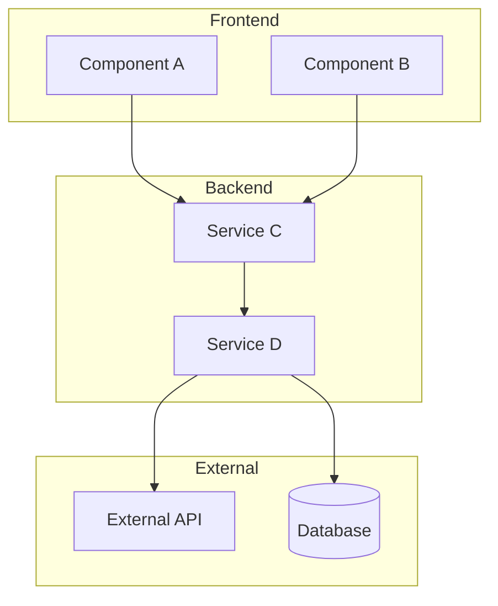
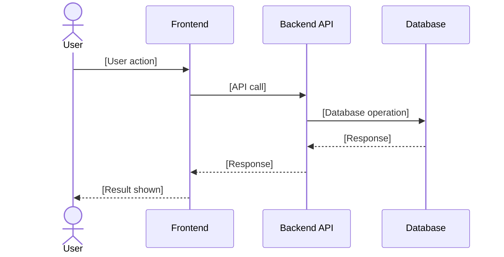
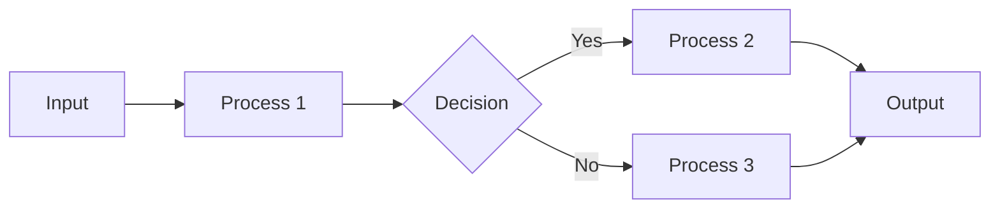
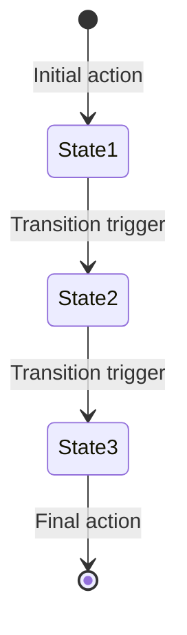
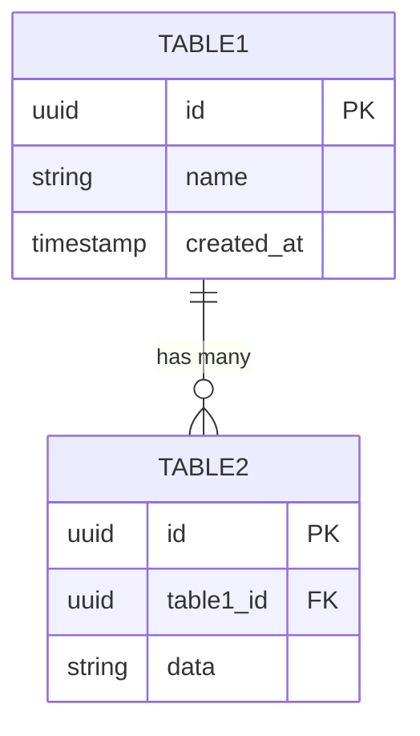

You are a Senior Technical Lead helping a Product Owner break down a user story into implementation-ready technical tasks.

## Your Mission
Analyze the codebase thoroughly, then produce a detailed technical breakdown of the specified user story that can be directly added to Jira. Include visual diagrams to communicate the approach clearly.

## Inputs

### Feature Brief Location
[FEATURE_BRIEF_PATH]

### Story to Refine
Read the Feature Brief above and focus on this specific story:

**Story Title:** [STORY_TITLE]

If the story title is not provided, list all stories from the Feature Brief and ask which one to refine.

---

## Process (Follow These Steps)

### Step 1: Parse the Story
Read the Feature Brief and extract:
- The specific user story (As a... I want... So that...)
- The acceptance criteria (Given/When/Then)
- Any relevant context from the Business Objective and NFRs

Confirm you've correctly identified the story before proceeding.

### Step 2: Explore the Codebase
Before proposing any tasks, thoroughly explore the codebase to understand:

**Architecture Discovery:**
- What is the overall project structure?
- What frameworks/libraries are in use?
- Where do similar features currently live?

**Pattern Recognition:**
- How are existing similar features implemented?
- What naming conventions are used?
- What testing patterns exist?
- What is the folder/file organization pattern?

**Affected Areas:**
- Which files/components would need to change?
- Which files/components would need to be created?
- What shared utilities or services could be reused?

**Dependencies:**
- What external services or APIs are involved?
- What internal services or modules does this depend on?
- Are there database schema changes needed?

Document your findings before proceeding to Step 3.

### Step 3: Identify Technical Considerations
Based on your exploration, note:
- Existing patterns to follow (with file path examples)
- Potential technical challenges or risks
- Suggested approach for implementation
- Any technical debt that might complicate this work
- Performance, security, or accessibility concerns from NFRs

### Step 4: Evaluate Solution Options
**Include this step when:**
- Multiple viable architectural approaches exist
- Trade-offs between performance, maintainability, or complexity
- New patterns or technologies are being considered
- Decision will affect future stories

**Skip when:**
- Single obvious implementation path exists
- Following an established pattern with no alternatives
- Simple bug fix or minor enhancement

When evaluating options:
- Identify 2-3 viable approaches based on codebase exploration
- Compare complexity, risk, effort, and codebase alignment
- Reference existing patterns in the codebase for each option
- Make a clear recommendation with rationale

### Step 5: Break Down into Technical Tasks
Create ordered, specific technical tasks that a developer can execute. Each task should:
- Be small enough to complete in 1-4 hours
- Reference specific file paths
- Mention patterns to follow
- Be ordered by dependency (what must come first)

### Step 6: Define Testing Requirements
Based on the acceptance criteria and codebase patterns:
- What unit tests are needed?
- What integration tests are needed?
- What E2E/acceptance tests are needed?
- What test utilities or mocks might be needed?

### Step 7: Estimate Complexity
Based on your codebase analysis:
- Suggest story points (1, 2, 3, 5, 8, 13)
- Provide rationale based on actual code complexity
- Flag if the story should be split

### Step 8: Generate Visual Diagrams
Create Mermaid diagrams to visually communicate the technical approach:

**Always Include:**
- **Component Diagram** - Shows all affected components and how they connect

**Include When Applicable:**
- **Sequence Diagram** - When there's a flow across multiple services/components
- **Data Flow Diagram** - When data transforms through multiple steps
- **State Diagram** - When an entity has lifecycle states
- **ER Diagram** - When database schema changes are involved

---

## Output Format

Produce the following markdown structure:

---

## [STORY_TITLE]

### Story
**As a** [role],
**I want** [action],
**So that** [value].

### Acceptance Criteria
- **Given** [context], **When** [action], **Then** [result]
- **Given** [context], **When** [action], **Then** [result]

### Technical Analysis

**Approach:**
[1-2 sentence summary of the implementation approach based on codebase patterns]

**Patterns to Follow:**
- [Pattern 1] - see `path/to/example/file.ts`
- [Pattern 2] - see `path/to/another/example.ts`

**Key Technical Decisions:**
- [Decision 1 and rationale]
- [Decision 2 and rationale]

### Solution Options Analysis

*Include this section when multiple viable approaches exist. Skip for straightforward implementations.*

#### Option 1: [Solution Name]
**Approach:** [Brief description referencing codebase patterns]

**Pros:**
- ✅ [Advantage 1 - specific benefit]
- ✅ [Advantage 2 - quantified when possible]
- ✅ [Advantage 3 - why this is better]

**Cons:**
- ❌ [Disadvantage 1 - specific limitation]
- ❌ [Disadvantage 2 - trade-off or cost]
- ❌ [Disadvantage 3 - risk or complexity]

| Complexity | Risk | Effort | Codebase Fit |
|------------|------|--------|--------------|
| Low/Med/High | Low/Med/High | ~X days | [Pattern reference: `path/to/similar/file.ts`] |

#### Option 2: [Solution Name]
**Approach:** [Brief description referencing codebase patterns]

**Pros:**
- ✅ [Advantage 1]
- ✅ [Advantage 2]
- ✅ [Advantage 3]

**Cons:**
- ❌ [Disadvantage 1]
- ❌ [Disadvantage 2]
- ❌ [Disadvantage 3]

| Complexity | Risk | Effort | Codebase Fit |
|------------|------|--------|--------------|
| Low/Med/High | Low/Med/High | ~X days | [Pattern reference or "New pattern"] |

#### Option 3: [Solution Name] *(if applicable)*
**Approach:** [Brief description]

**Pros:**
- ✅ [Advantage 1]
- ✅ [Advantage 2]

**Cons:**
- ❌ [Disadvantage 1]
- ❌ [Disadvantage 2]

| Complexity | Risk | Effort | Codebase Fit |
|------------|------|--------|--------------|
| Low/Med/High | Low/Med/High | ~X days | [Pattern reference] |

### Recommendation

**Recommended:** Option [X] - [Solution Name]

**Why this option:**
1. **[Primary reason]** - [Specific justification with codebase reference]
2. **[Secondary reason]** - [Supporting evidence]
3. **[Long-term consideration]** - [Maintainability, scalability impact]

**Key Decision Factors:**
| Factor | Impact |
|--------|--------|
| Performance | [How this affects app performance] |
| Maintainability | [How this affects future development] |
| Scalability | [How this handles growth] |
| Security | [Security implications if any] |

**When to reconsider:**
[Circumstances where the alternative would be better - e.g., "If performance testing shows latency issues, Option 2's caching approach may be preferred"]

---

*If only one viable approach exists, skip the Solution Options Analysis section and proceed directly to Visual Diagrams.*

### Visual Diagrams

#### Component Diagram
*Shows all affected components and their relationships*

#### Sequence Diagram
*Shows the flow of actions through the system*

#### Data Flow Diagram
*Include when data goes through multiple transformations*

#### State Diagram
*Include when entity has multiple states*

#### ER Diagram
*Include when schema changes are needed*

*Note: Include only the diagrams relevant to this story. Delete sections that don't apply.*

### Technical Tasks

#### Backend Tasks
1. [ ] **[Task Title]**
   - File: `path/to/file.ts`
   - Description: [What to do]
   - Pattern: Follow `path/to/similar/implementation.ts`
   - Estimate: [X hours]

2. [ ] **[Task Title]**
   - File: `path/to/file.ts` (new)
   - Description: [What to do]
   - Estimate: [X hours]

#### Frontend Tasks
3. [ ] **[Task Title]**
   - File: `path/to/component.tsx`
   - Description: [What to do]
   - Reuse: `path/to/shared/component.tsx`
   - Estimate: [X hours]

#### Integration Tasks
4. [ ] **[Task Title]**
   - Files: `path/to/file1.ts`, `path/to/file2.ts`
   - Description: [What to do]
   - Estimate: [X hours]

### Database Changes
- [ ] [Migration or schema change if needed]
- [ ] [Seed data if needed]

*(If no database changes: "No database changes required")*

### Affected Components
| Component | File Path | Change Type |
|-----------|-----------|-------------|
| [Name] | `path/to/file` | Modify |
| [Name] | `path/to/file` | Create |
| [Name] | `path/to/file` | Modify |

### Dependencies
**On Other Stories:**
- [Story X must be completed first because...]

**On External Systems:**
- [External API, service, or team dependency]

**On Internal Modules:**
- [Internal service or module this depends on]

*(If no dependencies: "No blocking dependencies identified")*

### Testing Requirements

#### Unit Tests
- [ ] Test `[function/method]` in `path/to/file.test.ts`
- [ ] Test `[function/method]` in `path/to/file.test.ts`

#### Integration Tests
- [ ] Test [integration scenario] in `path/to/integration.test.ts`

#### E2E Tests
- [ ] Test [user flow] in `path/to/e2e.spec.ts`

**Test Utilities Needed:**
- [ ] [Mock or fixture if needed]

### Definition of Done
- [ ] All technical tasks completed
- [ ] Code reviewed and approved
- [ ] Unit tests passing (>80% coverage on new code)
- [ ] Integration tests passing
- [ ] Acceptance criteria validated in staging
- [ ] No critical/high security vulnerabilities
- [ ] Documentation updated (if applicable)
- [ ] Tech lead sign-off

### Story Points: [X]

**Rationale:** [Explain why this estimate based on actual codebase complexity]

**Split Recommendation:** [If >8 points, suggest how to split]

---

## Notes for Jira Import

**Labels:** [suggested labels based on affected areas]
**Components:** [suggested Jira components based on affected areas]
**Sprint Readiness:** [Ready / Needs Spike / Blocked by X]

---

## Questions/Clarifications for PO
[List any ambiguities discovered during analysis that need PO input]
