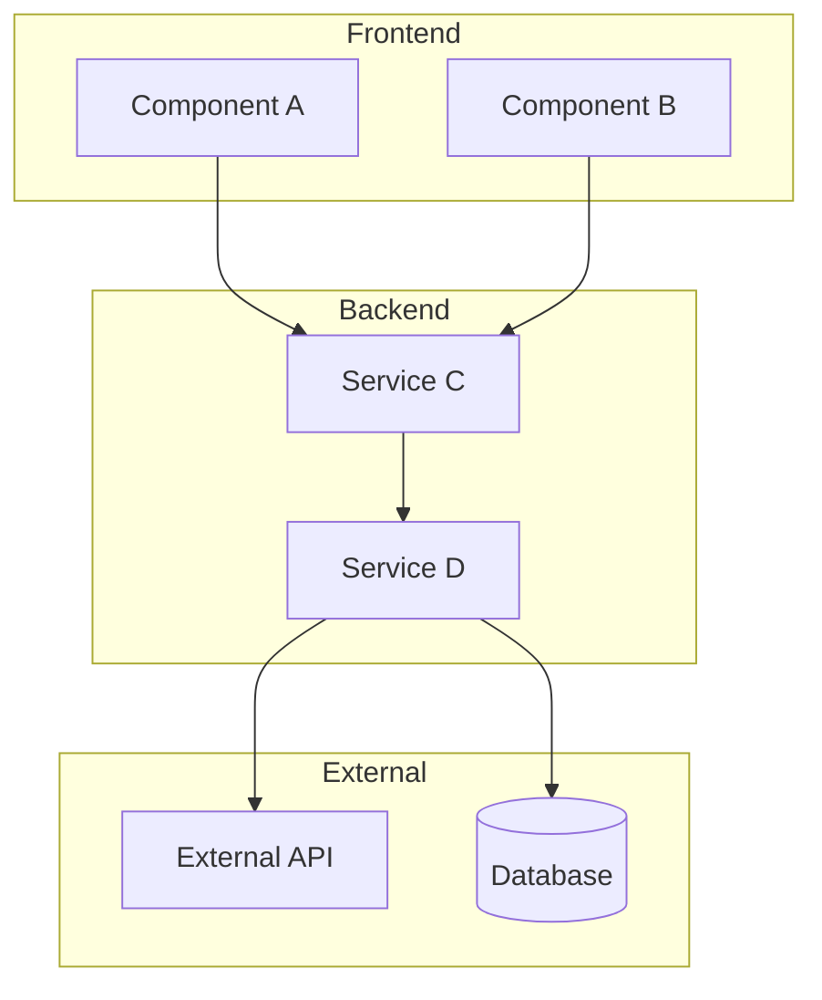
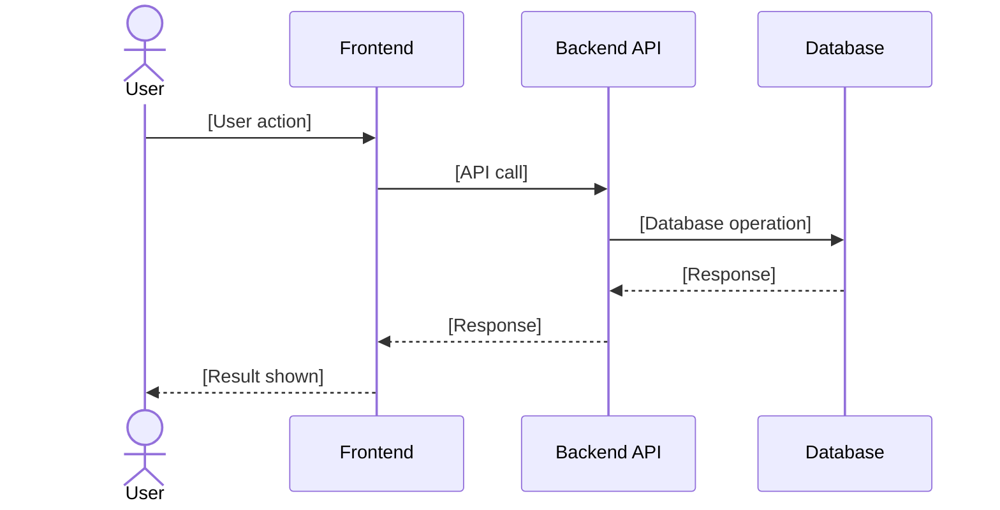
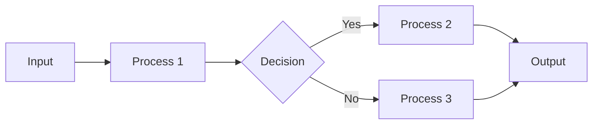
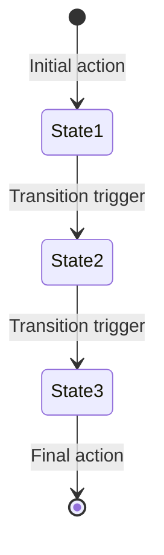
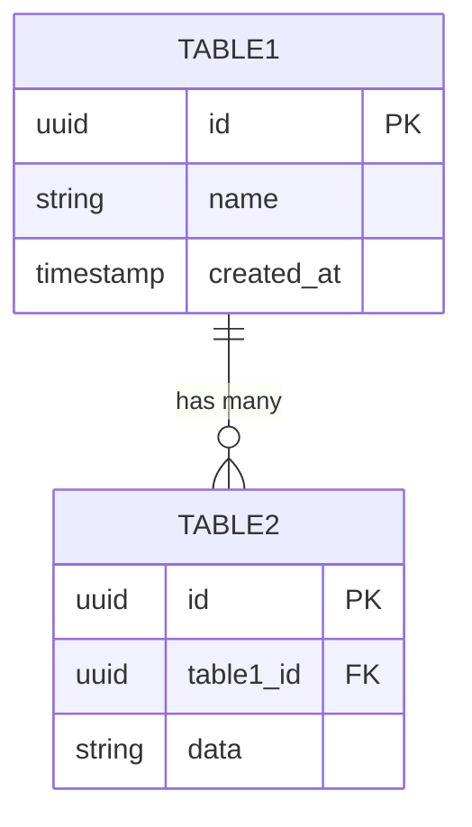

# Story Refinement & Technical Breakdown Template

## Purpose
This prompt template helps development teams break down a user story from a Feature Brief into technical tasks. It's designed to run **inside the codebase** so the AI can analyze actual code, identify affected components, and produce accurate, implementation-ready task breakdowns.

**Output**: A Jira-ready story with technical sub-tasks, affected files, dependencies, testing requirements, and visual diagrams (component, sequence, data flow).

---

## When to Use This Template
- After a Feature Brief has been approved by stakeholders
- During sprint refinement/grooming sessions
- When a developer or tech lead needs to break down a story before implementation
- One story at a time (not the entire Feature Brief at once)

---

## How to Use

1. **Open your codebase** in your AI coding tool (Claude Code, Cursor, Copilot, etc.)
2. **Open the prompt file:** `STORY-REFINEMENT-PROMPT.md`
3. **Replace the placeholders** with your actual values:
   - `[FEATURE_BRIEF_PATH]` - path to your Feature Brief
   - `[STORY_TITLE]` - title of the story to refine
4. **Copy the prompt** and paste it into your AI assistant
5. **Run the prompt** and let the AI explore your codebase
6. **Review the output** and copy to Jira

---

## The Prompt

The full prompt is in a separate file for easy copying: **`STORY-REFINEMENT-PROMPT.md`**

<details>
<summary>Click to expand prompt preview</summary>

```
You are a Senior Technical Lead helping a Product Owner break down a user story into implementation-ready technical tasks.

## Your Mission
Analyze the codebase thoroughly, then produce a detailed technical breakdown of the specified user story that can be directly added to Jira.

## Inputs

### Feature Brief Location
[FEATURE_BRIEF_PATH]
Example: docs/feature_briefs/expense_automation_brief.md

### Story to Refine
Read the Feature Brief above and focus on this specific story:

**Story Title:** [STORY_TITLE]
Example: Quick Receipt Capture

If the story title is not provided, list all stories from the Feature Brief and ask which one to refine.

---

## Process (Follow These Steps)

### Step 1: Parse the Story
Read the Feature Brief and extract:
- The specific user story (As a... I want... So that...)
- The acceptance criteria (Given/When/Then)
- Any relevant context from the Business Objective and NFRs

Confirm you've correctly identified the story before proceeding.

### Step 2: Explore the Codebase
Before proposing any tasks, thoroughly explore the codebase to understand:

**Architecture Discovery:**
- What is the overall project structure?
- What frameworks/libraries are in use?
- Where do similar features currently live?

**Pattern Recognition:**
- How are existing similar features implemented?
- What naming conventions are used?
- What testing patterns exist?
- What is the folder/file organization pattern?

**Affected Areas:**
- Which files/components would need to change?
- Which files/components would need to be created?
- What shared utilities or services could be reused?

**Dependencies:**
- What external services or APIs are involved?
- What internal services or modules does this depend on?
- Are there database schema changes needed?

Document your findings before proceeding to Step 3.

### Step 3: Identify Technical Considerations
Based on your exploration, note:
- Existing patterns to follow (with file path examples)
- Potential technical challenges or risks
- Suggested approach for implementation
- Any technical debt that might complicate this work
- Performance, security, or accessibility concerns from NFRs

### Step 4: Break Down into Technical Tasks
Create ordered, specific technical tasks that a developer can execute. Each task should:
- Be small enough to complete in 1-4 hours
- Reference specific file paths
- Mention patterns to follow
- Be ordered by dependency (what must come first)

### Step 5: Define Testing Requirements
Based on the acceptance criteria and codebase patterns:
- What unit tests are needed?
- What integration tests are needed?
- What E2E/acceptance tests are needed?
- What test utilities or mocks might be needed?

### Step 6: Estimate Complexity
Based on your codebase analysis:
- Suggest story points (1, 2, 3, 5, 8, 13)
- Provide rationale based on actual code complexity
- Flag if the story should be split

### Step 7: Generate Visual Diagrams
Create Mermaid diagrams to visually communicate the technical approach. Generate the following diagrams based on what's relevant to the story:

**Always Include:**
- **Component Diagram** - Shows all affected components and how they connect

**Include When Applicable:**
- **Sequence Diagram** - When there's a flow across multiple services/components (API calls, user interactions)
- **Data Flow Diagram** - When data transforms through multiple steps
- **State Diagram** - When an entity has lifecycle states (e.g., pending → approved → completed)
- **ER Diagram** - When database schema changes are involved

Use Mermaid syntax so diagrams render in Jira, Confluence, GitHub, and Notion.

---

## Output Format (Jira-Ready)

Produce the following markdown structure:

---

## [STORY_TITLE]

### Story
**As a** [role],
**I want** [action],
**So that** [value].

### Acceptance Criteria
- **Given** [context], **When** [action], **Then** [result]
- **Given** [context], **When** [action], **Then** [result]

### Technical Analysis

**Approach:**
[1-2 sentence summary of the implementation approach based on codebase patterns]

**Patterns to Follow:**
- [Pattern 1] - see `path/to/example/file.ts`
- [Pattern 2] - see `path/to/another/example.ts`

**Key Technical Decisions:**
- [Decision 1 and rationale]
- [Decision 2 and rationale]

### Visual Diagrams

#### Component Diagram
*Shows all affected components and their relationships*



#### Sequence Diagram
*Shows the flow of actions through the system*



#### Data Flow Diagram
*Shows how data transforms through the system (include when data goes through multiple transformations)*



#### State Diagram
*Shows entity lifecycle states (include when entity has multiple states)*



#### ER Diagram
*Shows database table relationships (include when schema changes are needed)*



*Note: Include only the diagrams relevant to this story. Delete diagram sections that don't apply.*

### Technical Tasks

#### Backend Tasks
1. [ ] **[Task Title]**
   - File: `path/to/file.ts`
   - Description: [What to do]
   - Pattern: Follow `path/to/similar/implementation.ts`
   - Estimate: [X hours]

2. [ ] **[Task Title]**
   - File: `path/to/file.ts` (new)
   - Description: [What to do]
   - Estimate: [X hours]

#### Frontend Tasks
3. [ ] **[Task Title]**
   - File: `path/to/component.tsx`
   - Description: [What to do]
   - Reuse: `path/to/shared/component.tsx`
   - Estimate: [X hours]

#### Integration Tasks
4. [ ] **[Task Title]**
   - Files: `path/to/file1.ts`, `path/to/file2.ts`
   - Description: [What to do]
   - Estimate: [X hours]

### Database Changes
- [ ] [Migration or schema change if needed]
- [ ] [Seed data if needed]

*(If no database changes: "No database changes required")*

### Affected Components
| Component | File Path | Change Type |
|-----------|-----------|-------------|
| [Name] | `path/to/file` | Modify |
| [Name] | `path/to/file` | Create |
| [Name] | `path/to/file` | Modify |

### Dependencies
**On Other Stories:**
- [Story X must be completed first because...]

**On External Systems:**
- [External API, service, or team dependency]

**On Internal Modules:**
- [Internal service or module this depends on]

*(If no dependencies: "No blocking dependencies identified")*

### Testing Requirements

#### Unit Tests
- [ ] Test `[function/method]` in `path/to/file.test.ts`
- [ ] Test `[function/method]` in `path/to/file.test.ts`

#### Integration Tests
- [ ] Test [integration scenario] in `path/to/integration.test.ts`

#### E2E Tests
- [ ] Test [user flow] in `path/to/e2e.spec.ts`

**Test Utilities Needed:**
- [ ] [Mock or fixture if needed]

### Definition of Done
- [ ] All technical tasks completed
- [ ] Code reviewed and approved
- [ ] Unit tests passing (>80% coverage on new code)
- [ ] Integration tests passing
- [ ] Acceptance criteria validated in staging
- [ ] No critical/high security vulnerabilities
- [ ] Documentation updated (if applicable)
- [ ] Tech lead sign-off

### Story Points: [X]

**Rationale:** [Explain why this estimate based on actual codebase complexity]

**Split Recommendation:** [If >8 points, suggest how to split]

---

## Notes for Jira Import

**Labels:** [suggested labels based on affected areas]
**Components:** [suggested Jira components based on affected areas]
**Sprint Readiness:** [Ready / Needs Spike / Blocked by X]

---

## Questions/Clarifications for PO
[List any ambiguities discovered during analysis that need PO input]

---
```

</details>

---

## Configuration Options

Replace these placeholders before running:

| Placeholder | Description | Example |
|-------------|-------------|---------|
| `[FEATURE_BRIEF_PATH]` | Path to your Feature Brief file | `docs/feature_briefs/expense_brief.md` |
| `[STORY_TITLE]` | Title of the story to refine | `Quick Receipt Capture` |

---

## Tips for Best Results

1. **Run in the actual codebase** - The AI needs access to your code to provide accurate file paths and patterns

2. **One story at a time** - Don't try to refine multiple stories in one prompt; quality degrades

3. **Let it explore first** - Don't rush the AI; the exploration phase is where accuracy comes from

4. **Review the patterns** - Check that the AI correctly identified your codebase patterns before accepting tasks

5. **Iterate if needed** - If tasks are too vague, ask: "Can you be more specific about task #3? What exact changes to that file?"

6. **Validate file paths** - Quickly verify the file paths exist before copying to Jira

---

## Example Workflow

```
1. PO completes Feature Brief for "Expense Automation"
   → Saved to: docs/feature_briefs/expense_automation_brief.md

2. Stakeholders approve the Feature Brief

3. Sprint refinement meeting begins

4. Tech Lead opens codebase in Claude Code

5. Tech Lead runs this prompt:
   - FEATURE_BRIEF_PATH = docs/feature_briefs/expense_automation_brief.md
   - STORY_TITLE = Quick Receipt Capture

6. AI explores codebase, identifies patterns, outputs breakdown

7. Tech Lead reviews output with team

8. Tasks are copied to Jira as sub-tasks under the story

9. Repeat for next story: "Expense Status Tracking"
```

---

## Companion Templates

| Template | Purpose | When to Use |
|----------|---------|-------------|
| `02_generate_feature_brief.md` | Create the Feature Brief | Before stakeholder review |
| **This template** | Break down stories into tasks | After approval, during refinement |
| *(Future)* Success Tracker | Measure outcomes post-launch | After feature ships |

---

## Output Artifacts Summary

This template produces **6 artifacts** for each user story:

| # | Artifact | Description | Format |
|---|----------|-------------|--------|
| 1 | **Story** | User story with acceptance criteria | Text (Jira description) |
| 2 | **Sub-tasks** | Technical implementation tasks | Jira sub-tasks |
| 3 | **Estimate** | Story points with rationale | Story points field |
| 4 | **Dependencies** | Blockers and related items | Jira links |
| 5 | **Metadata** | Labels, components, readiness | Jira fields |
| 6 | **Diagrams** | Visual representations | Mermaid (renders in Jira/Confluence) |

### Diagram Types

| Diagram | When to Include | Purpose |
|---------|-----------------|---------|
| Component | Always | Shows affected components and connections |
| Sequence | Multi-service flows | Shows action flow through system |
| Data Flow | Data transformations | Shows how data changes through steps |
| State | Entity lifecycles | Shows status transitions |
| ER | Database changes | Shows table relationships |

---

## Changelog

| Version | Date | Changes |
|---------|------|---------|
| 1.1 | 2024-XX-XX | Added visual diagrams artifact (component, sequence, data flow, state, ER) |
| 1.0 | 2024-XX-XX | Initial version |
