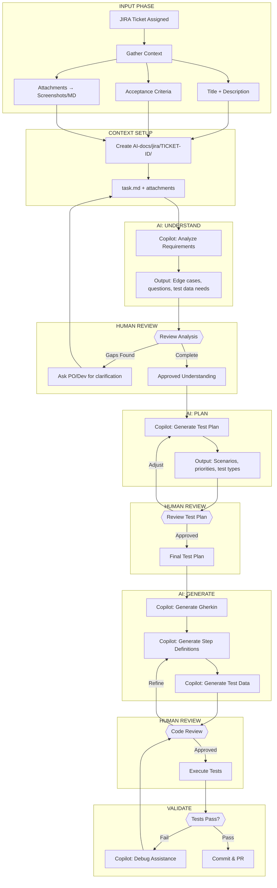
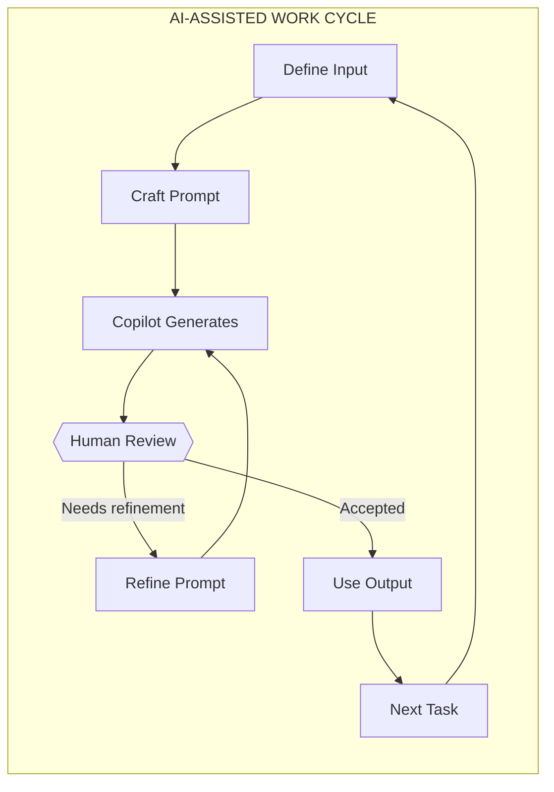
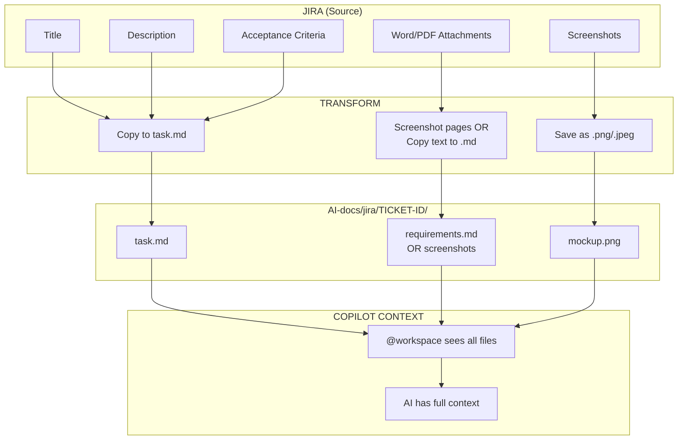
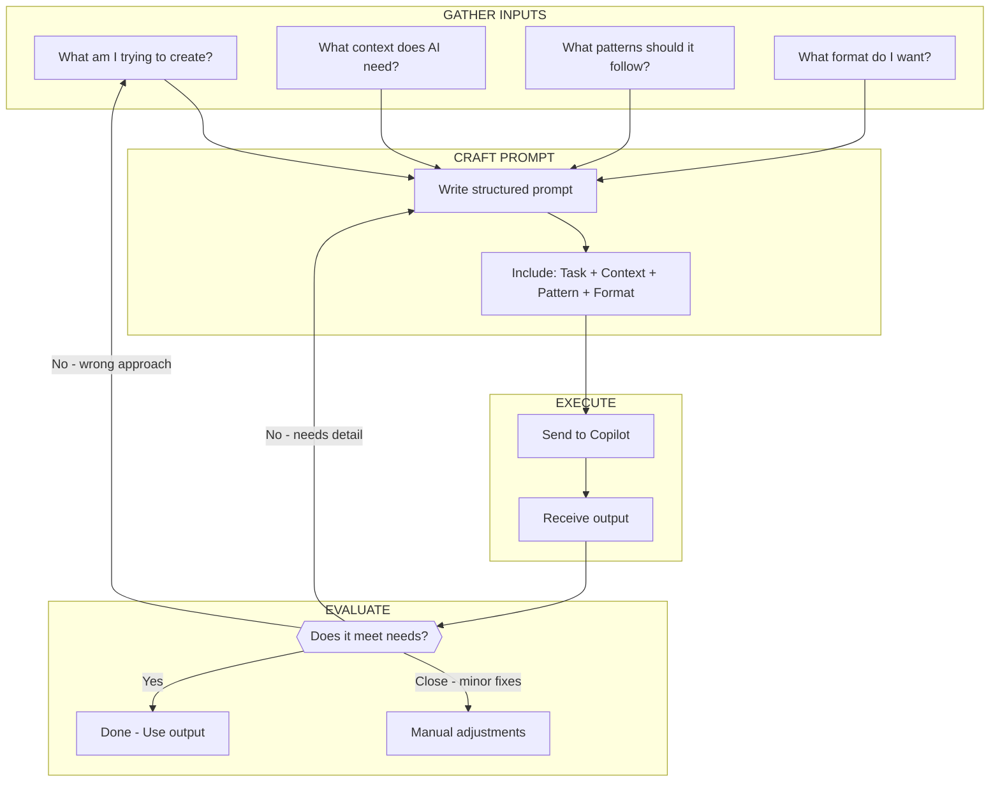
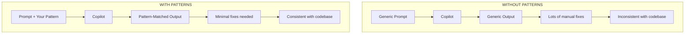
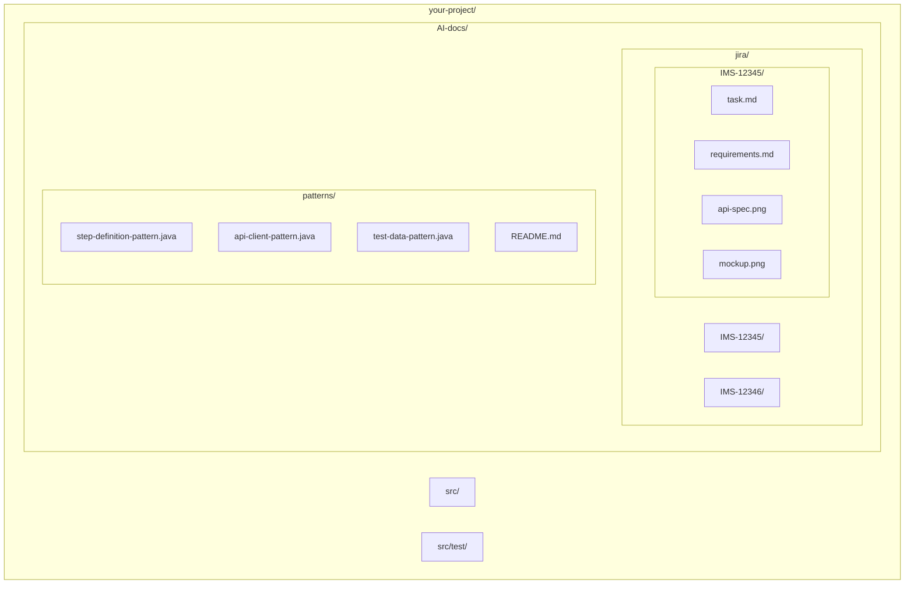
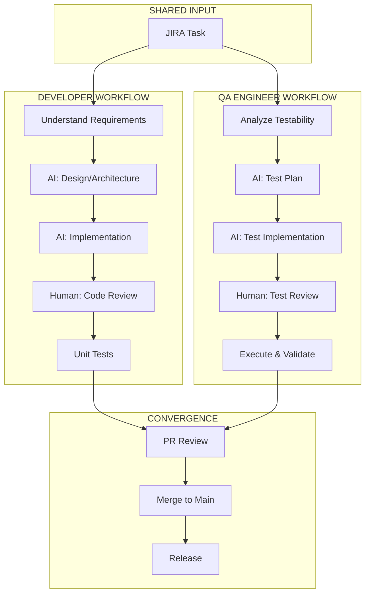
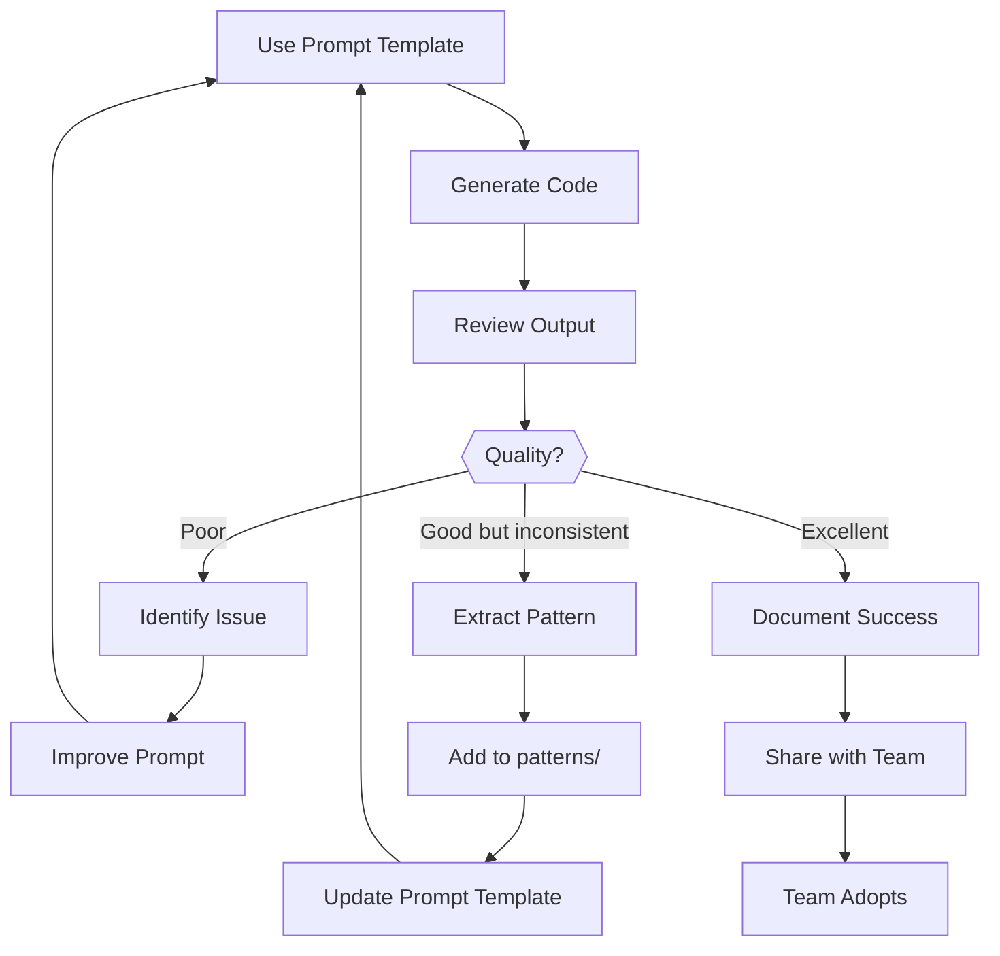

# Workflow Diagrams for Copilot Presentation

Visual representations of AI-assisted workflows with human-in-the-loop review points.

---

## Diagram 1: QA Engineer Daily Workflow (Human + AI)

Shows where AI assists and where humans review/decide.

**Legend:**
- Green = AI assists
- Yellow = Human decision point

---

## Diagram 2: The Human-in-the-Loop Cycle

Every AI output goes through human review before becoming final.

**Key Point:** AI is the assistant, human is the decision maker.

---

## Diagram 3: JIRA to Copilot Context Flow

How task information flows from JIRA into Copilot's context.

---

## Diagram 4: Prompt Engineering Workflow

The process of crafting effective prompts.

---

## Diagram 5: Test Automation Workflow Stages

Linear view of the QA workflow with AI touchpoints.

```mermaid
flowchart LR
    subgraph S1["STAGE 1"]
        A1["JIRA Task"]
        A2["AI: Analyze"]
        A3["Human: Review"]
    end

    subgraph S2["STAGE 2"]
        B1["Requirements"]
        B2["AI: Test Plan"]
        B3["Human: Approve"]
    end

    subgraph S3["STAGE 3"]
        C1["Test Plan"]
        C2["AI: Gherkin"]
        C3["Human: Review"]
    end

    subgraph S4["STAGE 4"]
        D1["Features"]
        D2["AI: Step Defs"]
        D3["Human: Review"]
    end

    subgraph S5["STAGE 5"]
        E1["Code"]
        E2["AI: Test Data"]
        E3["Human: Validate"]
    end

    subgraph S6["STAGE 6"]
        F1["Tests"]
        F2["Execute"]
        F3["AI: Debug if fail"]
    end

    A1 --> A2 --> A3 --> B1 --> B2 --> B3 --> C1 --> C2 --> C3 --> D1 --> D2 --> D3 --> E1 --> E2 --> E3 --> F1 --> F2 --> F3

```

---

## Diagram 6: Pattern-Based Code Generation

How patterns improve Copilot output quality.

---

## Diagram 7: AI-docs Folder Structure

Visual representation of the context folder structure.

---

## Diagram 8: Developer vs QA Workflow Comparison

Shows parallel workflows for both roles.

---

## Diagram 9: The Feedback Loop

Continuous improvement of prompts and patterns.

---

## Using These Diagrams in Your Presentation

1. **Opening:** Show Diagram 5 (Linear Workflow) - "This is what we do every day"

2. **Human-in-the-Loop:** Show Diagram 2 - "AI assists, YOU decide"

3. **Context Setup:** Show Diagram 3 (JIRA to Copilot) - "Here's how we get context to AI"

4. **Folder Structure:** Show Diagram 7 - "This is where everything lives"

5. **With/Without Patterns:** Show Diagram 6 - "This is why patterns matter"

6. **Full Workflow:** Show Diagram 1 - "Putting it all together"

---

## Rendering These Diagrams

**In VS Code:**
- Install "Markdown Preview Mermaid Support" extension
- Open preview: `Cmd+Shift+V`

**In GitHub:**
- Mermaid renders automatically in .md files

**For Presentation:**
- Use Mermaid Live Editor: https://mermaid.live
- Export as PNG/SVG for slides

**In Notion/Confluence:**
- Most support Mermaid natively or via plugin
