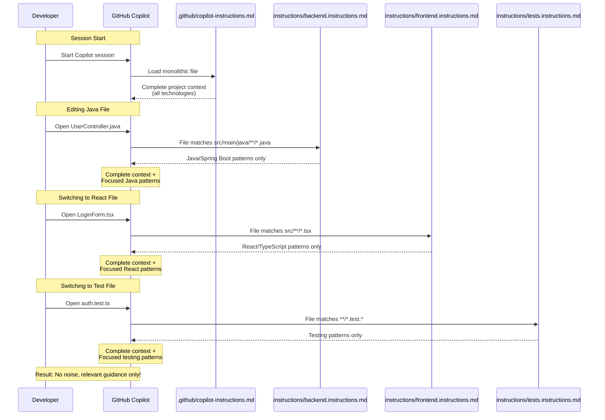

# GitHub Copilot Instructions - Complete Workflow
## Two-Step Automated Instruction System

---

## 📋 Overview

This document provides a visual representation of the complete two-step workflow for generating GitHub Copilot instruction files in your repository.

**Total Time:** ~20 minutes initially | ~5 minutes for quarterly updates
**Result:** Comprehensive monolithic file + focused specialized playbooks

---

## 🔄 Complete Workflow Diagram

```mermaid
flowchart TD
    Start([Start: Set Up GitHub Copilot Instructions]) --> Prerequisites{Prerequisites Met?}

    Prerequisites -->|Yes| Step1[STEP 1: Generate Monolithic File<br/>2-3 minutes automated]
    Prerequisites -->|No| CheckPrereq[Check Prerequisites:<br/>✅ GitHub Copilot license<br/>✅ VS Code + Copilot extension<br/>✅ Repo has code<br/>✅ Agent mode enabled]
    CheckPrereq --> Prerequisites

    Step1 --> RunPrompt1[Run: copilot-instruction-main-file-generator.md]
    RunPrompt1 --> Actions1[AI Actions:<br/>1. Analyze codebase<br/>2. Detect tech stack<br/>3. Identify patterns<br/>4. Cite evidence<br/>5. Generate file]
    Actions1 --> Output1[Output:<br/>.github/copilot-instructions.md<br/>200-500 lines]

    Output1 --> Step2[STEP 2: Human Review & Approval<br/>15 minutes]
    Step2 --> Review[Team Reviews:<br/>✅ Check accuracy<br/>✅ Add custom rules<br/>✅ Remove irrelevant sections<br/>✅ Verify evidence]
    Review --> Approve{Approved?}
    Approve -->|No| Step1
    Approve -->|Yes| Commit1[Commit approved monolithic file]

    Commit1 --> Step3[STEP 3: Generate Specialized Playbooks<br/>2-3 minutes automated]
    Step3 --> RunPrompt2[Run: Create-Path-Specific-Copilot-Instructions-V2.md]
    RunPrompt2 --> Actions2[AI Actions:<br/>1. Analyze monolithic file<br/>2. Map technology boundaries<br/>3. Derive focused playbooks<br/>4. Validate against codebase<br/>5. Append references]
    Actions2 --> Output2[Output:<br/>backend.instructions.md<br/>frontend.instructions.md<br/>tests.instructions.md<br/>+ Updated monolithic file]

    Output2 --> Step4[STEP 4: Commit All Files<br/>1 minute]
    Step4 --> GitCommit[git add .github/<br/>git commit<br/>git push]

    GitCommit --> Complete([✅ COMPLETE: System Active])

    Complete --> Usage[How Developers Use It]
    Usage --> Session[Start Copilot Session]
    Session --> LoadMonolithic[Loads: .github/copilot-instructions.md]
    LoadMonolithic --> EditFile{Editing File?}

    EditFile -->|Java File| LoadBackend[ALSO Loads:<br/>backend.instructions.md<br/>Result: Complete + Java patterns]
    EditFile -->|React File| LoadFrontend[ALSO Loads:<br/>frontend.instructions.md<br/>Result: Complete + React patterns]
    EditFile -->|Test File| LoadTests[ALSO Loads:<br/>tests.instructions.md<br/>Result: Complete + Test patterns]

    LoadBackend --> DevWork[Developer Works]
    LoadFrontend --> DevWork
    LoadTests --> DevWork

    DevWork --> Quarterly{Quarterly<br/>Update?}
    Quarterly -->|Yes| Maintenance[Re-run both prompts<br/>5 minutes total]
    Maintenance --> Step1
    Quarterly -->|No| DevWork


```

---

## 🔄 Maintenance Workflow (Quarterly - Every 3 Months)

```mermaid
flowchart LR
    Trigger{Significant<br/>Codebase<br/>Changes?} -->|New framework| Update[Quarterly Update Needed]
    Trigger -->|Major refactor| Update
    Trigger -->|Pattern changes| Update
    Trigger -->|New testing| Update

    Update --> Rerun1[Re-run Primary Prompt<br/>copilot-instruction-main-file-generator.md<br/>2 minutes]
    Rerun1 --> Review[Team Review<br/>Merge custom additions<br/>2 minutes]
    Review --> Rerun2[Re-run Follow-Up Prompt<br/>Create-Path-Specific-Copilot-Instructions-V2.md<br/>1 minute]
    Rerun2 --> CommitAll[Commit All Updated Files<br/>Total: 5 minutes]
    CommitAll --> Done([✅ Instructions Updated])

```

---

## 📊 File Structure Summary

```mermaid
graph TD
    Repo[your-repository/] --> GitHub[.github/]

    GitHub --> Monolithic[copilot-instructions.md<br/>📄 MONOLITHIC FILE<br/>━━━━━━━━━━━━━━━<br/>Loaded: EVERY session<br/>Contains: All technologies]

    GitHub --> Instructions[instructions/]

    Instructions --> Backend[backend.instructions.md<br/>📄 SPECIALIZED<br/>━━━━━━━━━━━━━━━<br/>Loaded: *.java files<br/>Contains: Java/Spring Boot]

    Instructions --> Frontend[frontend.instructions.md<br/>📄 SPECIALIZED<br/>━━━━━━━━━━━━━━━<br/>Loaded: *.tsx/*.jsx<br/>Contains: React/TypeScript]

    Instructions --> Tests[tests.instructions.md<br/>📄 SPECIALIZED<br/>━━━━━━━━━━━━━━━<br/>Loaded: *.test.* files<br/>Contains: Testing patterns]

```

---

## ✅ Success Criteria Checklist

### Initial Setup (First Time)
- [ ] Monolithic file generated and committed
- [ ] Team reviewed and approved monolithic file
- [ ] Specialized playbooks generated and committed
- [ ] All applyTo patterns validated (match actual files)
- [ ] File list appended to monolithic file
- [ ] Developers can see instructions loading in Copilot

### Validation (After Setup)
- [ ] Open a Java file → backend.instructions.md loads
- [ ] Open a React file → frontend.instructions.md loads
- [ ] Open a test file → tests.instructions.md loads
- [ ] Copilot suggestions match our patterns (not generic)
- [ ] No noise (React devs don't see Java patterns)

### Long-Term Maintenance
- [ ] Quarterly review calendar event created
- [ ] Process documented for team onboarding
- [ ] Designated owner for quarterly updates
- [ ] GitHub Actions for drift detection (future automation)

---

## 🎯 Key Benefits Recap

```mermaid
flowchart TB
    subgraph Before["❌ BEFORE: Generic Copilot"]
        B1[Generic code suggestions]
        B2[Inconsistent patterns across team]
        B3[Long code review cycles<br/>fixing style/patterns]
        B4[Slow onboarding<br/>learning wrong patterns]
        B5[Knowledge silos<br/>tribal rules not documented]
    end

    Before --> Transform[Implement Two-Step<br/>Instruction System]

    Transform --> After

    subgraph After["✅ AFTER: Two-Step Instruction System"]
        A1[Project-specific code<br/>matching YOUR patterns]
        A2[Consistent code<br/>across all team members]
        A3[20-30% reduction<br/>in code review time]
        A4[50% faster onboarding<br/>for new developers]
        A5[Knowledge democratization<br/>AI teaches best practices]
        A6[No noise<br/>focused guidance per file type]
    end
```

---

## 📖 How Instructions Load When Editing Files

---

## 📚 Related Documentation

- **Primary Prompt:** `copilot-instruction-main-file-generator.md`
- **Follow-Up Prompt:** `Create-Path-Specific-Copilot-Instructions-V2.md`
- **Presentation Deck:** `GitHub-Copilot-Instructions-Presentation-Deck-FINAL.md`
- **Official GitHub Docs:** [Adding repository custom instructions for GitHub Copilot](https://docs.github.com/en/copilot/customizing-copilot/adding-custom-instructions-for-github-copilot)

---

## ❓ FAQ

**Q: Do I need to run both prompts every time?**
A: Only initially and for quarterly updates. Day-to-day development just uses the existing files.

**Q: What if my repo has multiple languages (full-stack)?**
A: Perfect! The monolithic file documents all technologies, and you'll get multiple specialized playbooks (backend.instructions.md + frontend.instructions.md + tests.instructions.md).

**Q: Can I manually edit the generated files?**
A: Yes! The prompts generate 90% accuracy. Teams should refine the remaining 10% with project-specific rules.

**Q: What happens if I skip Step 3 (specialized files)?**
A: The monolithic file alone still works and provides value. Specialized files are the "advanced layer" that eliminates noise.

**Q: How do I know if specialized files are loading?**
A: When editing a file, ask Copilot "What instructions do you have for this file?" It will reference both monolithic and specialized files.

---

**END OF WORKFLOW DOCUMENTATION**
