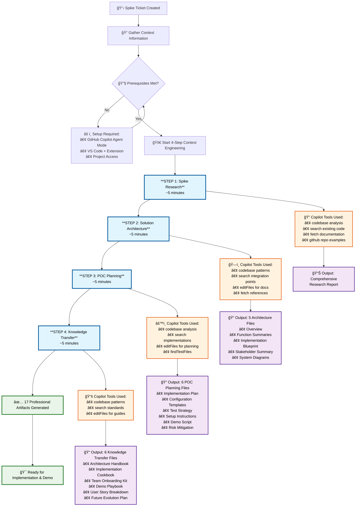
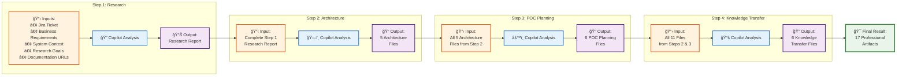
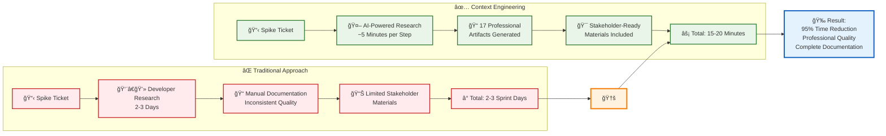
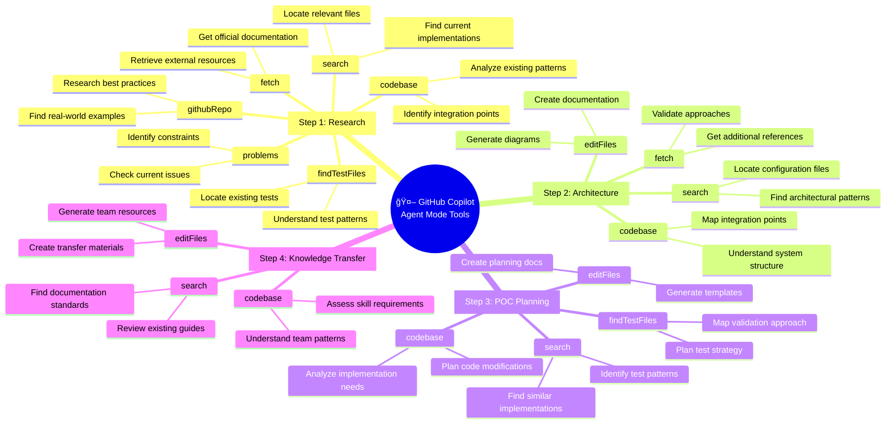

I'll create a comprehensive Mermaid diagram that visually explains the entire Context Engineering flow for your presentation.## 🯠**Perfect Presentation Diagrams Created!**

# Context Engineering Spike Research Flow

## Complete Process Flow Diagram

## Input/Output Flow per Step

## Value Transformation

## GitHub Copilot Tools Integration

## Presentation Talking Points

### Slide 1: The Challenge
- "Traditional spike research takes 2-3 days of developer time per sprint"
- "Results in inconsistent documentation and limited stakeholder materials"

### Slide 2: The Solution  
- "Context Engineering leverages GitHub Copilot's agent mode tools"
- "Systematic 4-step process produces professional results in minutes"

### Slide 3: The Process
- "Each step takes ~5 minutes using Copilot's systematic tool analysis"
- "17 professional artifacts generated automatically"

### Slide 4: The Value
- "95% time reduction from days to minutes"
- "Stakeholder-ready materials included"
- "Complete team knowledge transfer package"

### Slide 5: The Results
- "From chaos to systematic, predictable outcomes"
- "Enterprise-grade documentation automatically generated"
- "Ready for immediate implementation and presentation"

I've created **4 comprehensive Mermaid diagrams** that visually explain your Context Engineering methodology:

### 📊 **Diagram 1: Complete Process Flow**
- Shows the entire 4-step journey from spike ticket to final artifacts
- Includes prerequisites, tools used, and outputs for each step
- Perfect for explaining the overall methodology

### 🔄 **Diagram 2: Input/Output Flow per Step** 
- Demonstrates how outputs from each step become inputs for the next
- Shows the systematic chaining approach
- Great for explaining the copy-paste workflow

### âš¡ **Diagram 3: Value Transformation**
- Visual before/after comparison (Traditional vs Context Engineering)
- Shows the dramatic time reduction (2-3 days → 15-20 minutes)
- Perfect for ROI demonstration

### ğŸ› ï¸ **Diagram 4: GitHub Copilot Tools Integration**
- Mind map showing all the Copilot agent mode tools used
- Demonstrates the systematic tool usage approach
- Great for technical audience explanation

## 🬠**Presentation Flow Suggestion:**

1. **Start with Diagram 3** - Show the transformation value
2. **Use Diagram 1** - Explain the complete process
3. **Detail with Diagram 2** - Show the systematic chaining
4. **Technical deep-dive with Diagram 4** - Demonstrate tool sophistication

## 📋 **Usage Instructions:**

1. **Copy the Mermaid code** into your presentation tool (most support Mermaid)
2. **Use the talking points** provided for each diagram
3. **Customize colors/styling** to match your company branding

**These diagrams will make your Innovation Week presentation incredibly compelling!** 🚀

The visual storytelling combined with your real execution results will absolutely wow your audience!