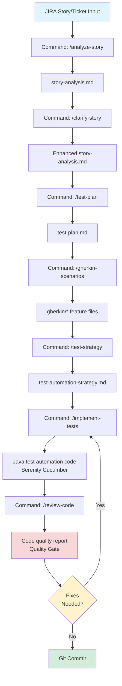

# QA SDET Automation Kit

**Spec-Driven Test Automation for Quality Engineers**

This is a specialized variant of Spec-Kit designed specifically for **QA Engineers, SDETs, and Test Automation Engineers**. While the original Spec-Kit is built for software developers creating features, this kit focuses on the **test automation workflow**: analyzing requirements, planning tests, writing Gherkin scenarios, defining automation strategy, and implementing tests.

---

## 🎯 Purpose

Transform JIRA stories into comprehensive, automated test suites following BDD best practices with Serenity Cucumber framework.

**Key Difference from Developer Spec-Kit**:
- Developer Spec-Kit: Define feature → Design → Implement **production code**
- QA SDET Kit: Analyze story → Plan tests → Write Gherkin → Implement **test automation code**

---

## 🔄 Workflow Overview



---

## 📋 Commands

### 1. `/analyze-story` - Story Analysis

**Purpose**: Parse JIRA story and extract testable requirements

**Input**: JIRA story key or story description

**Output**: `specs/[STORY-KEY]/story-analysis.md`

**What it does**:
- Extracts acceptance criteria
- Identifies user personas
- Maps functional requirements
- Categorizes test scenarios (positive, negative, edge cases)
- Identifies test data needs
- Documents risks and dependencies

**Example**:
```
/analyze-story PROJ-123: User can update their profile information
```

**Generates**:
- Story summary
- Acceptance criteria breakdown
- Test scenario categories
- Non-functional requirements
- Test data requirements
- Integration dependencies

---

### 2. `/clarify-story` - Resolve Ambiguities

**Purpose**: Identify and resolve unclear requirements before test planning

**Prerequisites**: Requires `story-analysis.md`

**Output**: Enhanced `story-analysis.md` with clarifications

**What it does**:
- Scans story for ambiguities (vague terms, missing details)
- Asks up to 5 targeted questions (multiple choice or short answer)
- Updates story analysis after each answer
- Documents clarifications for audit trail

**Example**:
```
/clarify-story
```

**Question Examples**:
- "What user roles can perform this action?" (Admin / User / Both)
- "What is the expected response time?" (< 1s / < 2s / < 5s)
- "How should duplicate entries be handled?" (Error / Merge / Allow)

---

### 3. `/test-plan` - Create Test Plan

**Purpose**: Generate comprehensive test plan document

**Prerequisites**: Requires `story-analysis.md`

**Output**: `specs/[STORY-KEY]/test-plan.md`

**What it does**:
- Defines test scope (in-scope / out-of-scope)
- Defines test strategy (levels, types, automation approach)
- Maps scenarios to test cases
- Defines test environment requirements
- Creates test schedule
- Documents risks and mitigation
- Defines entry/exit criteria

**Example**:
```
/test-plan
```

**Generates**:
- Test strategy (UI / API / Integration)
- Test case mapping (TC-001, TC-002, etc.)
- Environment requirements
- Test data requirements
- Risk assessment
- Test schedule

---

### 4. `/gherkin-scenarios` - Generate BDD Scenarios

**Purpose**: Convert test cases to Gherkin Given/When/Then format

**Prerequisites**: Requires `test-plan.md`

**Output**: `specs/[STORY-KEY]/gherkin/*.feature` files

**What it does**:
- Converts test cases to Gherkin scenarios
- Applies proper Given/When/Then structure
- Uses tags (@smoke, @P0, @api, @ui)
- Creates Scenario Outlines for data-driven tests
- Generates step definitions guide

**Example**:
```
/gherkin-scenarios
```

**Generates**:
```gherkin
@PROJ-123 @user-profile @smoke @P0 @ui
Feature: User Profile Management
  As a user
  I want to update my profile
  So that my information is current

  Scenario: Successfully update profile name
    Given I am logged in as a "regular user"
    And I am on the profile page
    When I update my name to "John Doe"
    And I click the Save button
    Then I should see "Profile updated successfully"
    And my profile name should be "John Doe"
```

---

### 5. `/test-strategy` - Define Automation Strategy

**Purpose**: Create detailed test automation framework strategy

**Prerequisites**: Requires `gherkin/*.feature` files

**Output**: `specs/[STORY-KEY]/test-automation-strategy.md`

**What it does**:
- Defines technology stack (Java, Serenity, Cucumber, Maven/Gradle)
- Defines framework architecture (Page Object Model / Screenplay)
- Defines project structure (packages, layers)
- Defines design patterns
- Defines coding standards
- Defines CI/CD integration
- Defines reporting approach

**Example**:
```
/test-strategy
```

**Generates**:
- Technology stack specification
- Framework architecture diagram
- Project structure layout
- Design pattern examples (Page Objects, API Clients)
- Implementation guidelines
- CI/CD pipeline configuration
- Serenity reporting setup

---

### 6. `/implement-tests` - Execute Implementation

**Purpose**: Generate test automation code (Java + Serenity + Cucumber)

**Prerequisites**: Requires `test-automation-strategy.md` and `gherkin/*.feature` files

**Output**: Java test automation code in test framework

**What it does**:
- Creates step definition classes
- Implements Page Objects (for UI tests)
- Implements API clients (for API tests)
- Creates model/POJO classes
- Creates utility classes (TestDataGenerator, ConfigManager)
- Creates test runners (Smoke, Regression, API, UI)
- Configures Serenity and Cucumber
- Generates implementation summary

**Example**:
```
/implement-tests
```

**Generates**:
```
src/test/java/
├── stepdefinitions/
│   ├── ui/UserManagementSteps.java
│   └── api/UserApiSteps.java
├── pages/
│   ├── LoginPage.java
│   └── UserProfilePage.java
├── api/
│   └── UserApiClient.java
├── models/
│   └── User.java
├── utils/
│   ├── TestDataGenerator.java
│   └── ConfigManager.java
└── runners/
    ├── SmokeTestRunner.java
    └── ApiTestRunner.java
```

---

### 7. `/review-code` - Code Quality Review ⭐ NEW

**Purpose**: Perform comprehensive code quality review before Git commit

**Prerequisites**: Requires completed `/implement-tests`

**Output**: `specs/[STORY-KEY]/code-quality-report.md`

**What it does**:
- Analyzes test code against clean code principles
- Validates constitutional compliance (POM, API Client Pattern)
- Checks function size, complexity, and responsibilities
- Identifies code duplication (DRY violations)
- Validates test independence and data management
- Detects flaky test patterns (Thread.sleep, hardcoded waits)
- Provides severity-ranked violations (CRITICAL, HIGH, MEDIUM, LOW)
- Offers auto-fix capability for violations
- Gates Git commit until quality standards met

**Example**:
```
/review-code
```

**Generates Report With**:
- 🔴 CRITICAL violations (must fix - constitutional violations, security issues)
- 🟠 HIGH violations (should fix - maintainability issues)
- 🟡 MEDIUM violations (improve when possible)
- ⚪ LOW violations (optional improvements)
- Quality metrics (Constitution compliance, function size, DRY score)
- Gate decision: PASS ✅ (ready to commit) or FAIL 🔴 (fixes required)

**Interactive Remediation**:
```
Found 8 violations (2 Critical, 3 High, 3 Medium)

Would you like me to:
[A] Auto-fix all CRITICAL and HIGH violations
[B] Show detailed fix for each violation
[C] Explain why these are violations
[D] Fix only CRITICAL violations
[E] Accept violations and document reasoning

Your choice: A

✅ Applied fixes to 5 violations
🔄 Re-running review...
✅ All CRITICAL and HIGH violations resolved
✅ Ready to commit!
```

**What Gets Checked**:

**Clean Code Principles**:
- Function size (target: ≤5 lines, max: 20 lines)
- Single Responsibility Principle
- Consistent abstraction levels
- Parameter count (0-2 ideal, 3 max)
- Command-Query Separation
- Proper exception handling
- Descriptive naming

**Constitutional Standards**:
- Page Object Model (no WebDriver in step definitions)
- API Client Pattern (no RestAssured in step definitions)
- Test Independence (no order dependencies)
- Test Data Management (no hardcoded data)

**Test-Specific Patterns**:
- No Thread.sleep() (use explicit waits)
- No flaky test patterns
- Proper assertion usage
- Clean test setup

**Example Violation Report**:
```markdown
❌ VIOLATION #1: PasswordResetSteps.java:45
Rule Broken: Page Object Model - WebDriver in Step Definition
Severity: CRITICAL

Issue:
@When("I click the reset button")
public void iClickResetButton() {
    driver.findElement(By.id("reset-btn")).click(); // ❌
}

Suggested Fix:
@Steps
private ResetPasswordPage resetPasswordPage;

@When("I click the reset button")
public void iClickResetButton() {
    resetPasswordPage.clickResetButton(); // ✅
}

Auto-Fix Available: Yes
```

**When to Use**: Always run after `/implement-tests` before Git commit

**Benefits**:
- Prevents technical debt
- Enforces constitutional principles
- Educates QA engineers on clean code
- Maintains consistent code quality
- Catches issues before code review
- Reduces maintenance burden

---

## 🛠️ Technology Stack

This kit generates test automation for:

### Core Technologies
- **Java**: 11/17
- **Build Tool**: Maven or Gradle
- **Test Framework**: JUnit 5 / TestNG
- **BDD Framework**: Cucumber
- **Automation Framework**: Serenity BDD
- **UI Automation**: Selenium WebDriver (for UI tests)
- **API Automation**: RestAssured (for API tests)

### Additional Libraries
- **Assertions**: AssertJ / Hamcrest
- **Test Data**: Faker, DataFactory
- **JSON**: Jackson, Gson
- **Logging**: SLF4J, Logback

### CI/CD Integration
- Jenkins
- GitHub Actions
- GitLab CI
- Azure DevOps

---

## 📁 Generated Artifacts Structure

```
specs/
└── PROJ-123-feature-name/
    ├── story-analysis.md                    # /analyze-story
    ├── test-plan.md                         # /test-plan
    ├── test-automation-strategy.md          # /test-strategy
    ├── implementation-summary.md            # /implement-tests
    ├── code-quality-report.md               # /review-code ⭐ NEW
    ├── gherkin/                             # /gherkin-scenarios
    │   ├── user_authentication.feature
    │   ├── user_profile.feature
    │   └── api_users.feature
    └── step-definitions-guide.md            # /gherkin-scenarios
```

---

## 🎯 Key Features

### 1. BDD-First Approach
- Gherkin scenarios are business-readable
- Scenarios serve as living documentation
- Given/When/Then structure enforced

### 2. Serenity Integration
- Comprehensive HTML reports
- Screenshots for UI tests
- API request/response documentation
- Trend analysis

### 3. Design Patterns
- **Page Object Model** for UI tests
- **Screenplay Pattern** (optional advanced)
- **API Client Pattern** for API tests

### 4. Test Organization
- Tags for filtering (@smoke, @P0, @api, @ui)
- Priority-based execution
- Parallel execution support

### 5. CI/CD Ready
- Maven/Gradle execution
- Jenkins pipeline templates
- GitHub Actions workflows

---

## 🚀 Quick Start

### Step 1: Analyze JIRA Story
```
/analyze-story PROJ-123: Users can filter products by category and price range
```

### Step 2: Clarify Ambiguities
```
/clarify-story
```
*Answer 1-5 questions to resolve unclear requirements*

### Step 3: Create Test Plan
```
/test-plan
```

### Step 4: Generate Gherkin Scenarios
```
/gherkin-scenarios
```

### Step 5: Define Test Strategy
```
/test-strategy
```

### Step 6: Implement Tests
```
/implement-tests
```

### Step 7: Review Code Quality ⭐ NEW
```
/review-code
```
*Review violations, apply auto-fixes, ensure quality gates pass*

### Step 8: Execute Tests
```bash
# Compile and verify
mvn clean compile

# Run all tests
mvn clean verify

# Run smoke tests only
mvn clean verify -Dcucumber.filter.tags="@smoke"

# Run API tests only
mvn clean verify -Dtest=ApiTestRunner

# View Serenity report
open target/site/serenity/index.html
```

### Step 9: Commit to Git
```bash
# Only after /review-code passes
git add .
git commit -m "feat(test): Add password reset test automation (PROJ-456)"
git push origin test/proj-456
```

---

## 🎨 Example Workflow

### Input: JIRA Story
```
PROJ-456: As a user, I want to reset my password via email so that I can regain access to my account if I forget my password.

Acceptance Criteria:
- User can request password reset
- Email is sent with reset link
- Link expires after 24 hours
- User can set new password
- Old password no longer works
```

### Output: Generated Artifacts

1. **story-analysis.md**: 10 test scenarios identified (5 positive, 3 negative, 2 edge cases)
2. **test-plan.md**: 15 test cases mapped (TC-001 to TC-015)
3. **gherkin/*.feature**: 15 Gherkin scenarios across 2 feature files
4. **test-automation-strategy.md**: Serenity Cucumber + Page Object Model
5. **Java test code**: 5 step definition classes, 3 page objects, 1 API client
6. **code-quality-report.md**: ✅ All quality gates passed, ready to commit

---

## 🔍 Comparison: Developer Spec-Kit vs QA SDET Kit

| Aspect | Developer Spec-Kit | QA SDET Kit |
|--------|-------------------|-------------|
| **Starting Point** | Natural language feature idea | JIRA story/ticket (already defined) |
| **First Command** | `/specify` (define feature) | `/analyze-story` (analyze requirements) |
| **Output Type** | Production code | Test automation code |
| **Design Artifacts** | plan.md, data-model.md, contracts/ | test-plan.md, gherkin/*.feature, test-automation-strategy.md |
| **Code Language** | Any (Python, Java, JS, etc.) | Java (Serenity Cucumber) |
| **Framework** | User's choice | Serenity Cucumber BDD |
| **Test Type** | Unit tests, integration tests | UI tests, API tests, E2E tests, BDD scenarios |
| **Documentation Style** | Technical specifications | Gherkin (Given/When/Then) |
| **Quality Gate** | Optional | `/review-code` - Mandatory before commit ⭐ |

---

## 📝 Best Practices

### 1. Story Analysis
- Be thorough in identifying test scenarios
- Don't skip edge cases
- Document all assumptions
- Identify risks early

### 2. Clarifications
- Ask targeted, specific questions
- Focus on testability
- Document answers for audit trail

### 3. Test Planning
- Define clear scope boundaries
- Prioritize test cases (P0 > P1 > P2)
- Plan for both positive and negative flows
- Consider non-functional requirements

### 4. Gherkin Writing
- Keep scenarios independent
- Use descriptive names
- Focus on business behavior, not implementation
- Apply tags consistently

### 5. Test Implementation
- Follow Page Object Model for UI
- Use API client pattern for APIs
- Keep step definitions thin
- Write reusable utility functions
- Maintain clean code standards

### 6. Code Quality Review ⭐ NEW
- **Always run** `/review-code` before committing
- **Fix CRITICAL violations** immediately (constitutional violations)
- **Address HIGH violations** before commit (maintainability issues)
- **Use auto-fix** for quick remediation when available
- **Learn from violations** - understand why they matter
- **Don't skip** - prevents technical debt accumulation
- **Run after each change** if iterating on fixes
- **Document exceptions** if accepting violations (rare)

**Best Practices**:
- ✅ Run review after implementation complete
- ✅ Use auto-fix option for known patterns
- ✅ Read violation explanations to learn
- ✅ Fix all CRITICAL before commit (non-negotiable)
- ✅ Fix HIGH violations when possible
- ✅ Accept MEDIUM only with good reason
- ❌ Don't skip review to save time
- ❌ Don't commit with CRITICAL violations
- ❌ Don't ignore repeated violations

### 7. Maintenance
- Update scenarios when requirements change
- Refactor duplicated code
- Keep test data fresh
- Monitor and fix flaky tests

---

## 🔧 Scripts

The kit includes PowerShell scripts for automation:

- **create-test-feature.ps1**: Initialize test feature structure
- **check-test-prerequisites.ps1**: Validate workflow prerequisites
- **common.ps1**: Shared utility functions

---

## 📊 Reporting

Serenity BDD generates comprehensive reports:
- **Test Execution Results**: Pass/Fail status
- **Screenshots**: For UI test failures
- **API Documentation**: Request/response details
- **Coverage**: By feature, tag, priority
- **Trends**: Historical test results

**Report Location**: `target/site/serenity/index.html`

---

## 🤝 Contributing

This QA SDET Automation Kit is designed to be extensible:
- Add custom templates for your organization
- Extend prompts for specific test types
- Customize framework architecture
- Add integration with your test management tools

---

## 📚 Resources

- **Serenity BDD**: https://serenity-bdd.info
- **Cucumber**: https://cucumber.io
- **Page Object Model**: https://www.selenium.dev/documentation/test_practices/encouraged/page_object_models/
- **BDD Best Practices**: https://cucumber.io/docs/bdd/

---

## 🆚 When to Use This Kit

**Use QA SDET Kit when**:
- You are a QA Engineer/SDET
- You receive JIRA stories to test
- You need to create test automation
- You use Serenity Cucumber BDD
- You follow BDD practices

**Use Developer Spec-Kit when**:
- You are building new features
- You define requirements from scratch
- You write production code
- You use any tech stack
- You follow TDD practices

---

**Version**: 1.0.0
**Last Updated**: 2025-01-XX
**Framework**: Serenity Cucumber BDD (Java)
